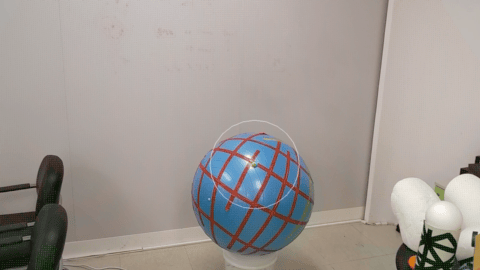
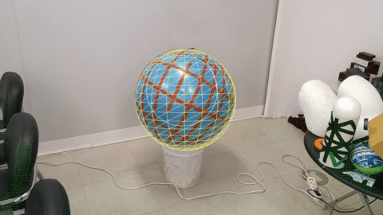

# FindSurface-HoloLensDemo-UWP (C++)

***CurvSurf** FindSurface™* HoloLensDemo for UWP (C++) 


## Overview

This demo is a Holographic UWP application that demonstrates FindSurface API with raw depth stream (research mode).
The FindSurface library for UWP is included in the [ext](ext) directory in this demo project.

<!--
## Contents

| File/folder | Description |
|-------------|-------------|
| `ext` | FindSurface Library for UWP (C++/WinRT) |
| `HolographicFindSurfaceDemo` | C++ application files and assets. |
| `HolographicFindSurfaceDemo.sln` | Visual Studio solution file. |
| `README.md` | This README file. |
-->

## Prerequisites

* HoloLens 2 device (HoloLens 1 is not supported)
* Visual Studio 2019 or higher.
* Install the [latest Mixed Reality tools](https://docs.microsoft.com/windows/mixed-reality/develop/install-the-tools)

## Setup

1. [Enable Device Portal and Research Mode](https://docs.microsoft.com/windows/mixed-reality/research-mode)

## Running the sample

1. Run from the debugger in Visual Studio by pressing F5
2. The app will show up in the start menu in HoloLens

## User Interface

This app supports eye-tracking features and voice commands, both built-in features of HoloLens2. During the holographic experiences using this app, Users gaze at target places in the space and activate FindSurface API functions using voice commands.

### Gazing at target surfaces (Eye-tracking)

<!-- Eye-gaze: https://docs.microsoft.com/en-us/windows/mixed-reality/design/eye-tracking -->
<!-- Hand-gaze: https://docs.microsoft.com/en-us/windows/mixed-reality/design/point-and-commit -->

The gazing point follows where users' eyes gaze. If the [eye-tracking](https://docs.microsoft.com/en-us/windows/mixed-reality/design/eye-tracking) feature isn't available for reasons like an inconvenience with eye-tracking or calibration failures, etc., disable the eye-tracking features in the settings panel. The app will allow users to [use their hands](https://docs.microsoft.com/en-us/windows/mixed-reality/design/point-and-commit) as an alternative to eye-tracking. If no hands are detected, the traditional way (head tracking like what users do in HoloLens 1) is used.



Using the gazing point, users point to a place to detect surfaces and how large the target surface is. The circle around the gazing point implies the size of the target object to detect. Users can change the size using [the voice commands mentioned below](#parameter-adjustment).


### Activating FindSurface using Voice Commands

To use this app, users must permit to use the mic in their devices since the app heavily depends on the voice commands to activate the core features.
When the app is launched, the system will play the alarm message "Voice command is ready" if the voice command is available. Check the mic permission on your HoloLens device if the message is not played or the voice commands are not working.

)

Once `FindSurface` is activated, it tries to keep detecting a surface that matches the given type from the point cloud of the scene. Whenever `FindSurface` detects a matching surface, `MeshRenderer` will render a surface mesh corresponding to the matching type for every detection result. Users can capture the snapshot of the surface and hold it in the place by saying "capture" or "catch it." The `Mesh Renderer` visualizes those captured surfaces in augmented reality rendering.

The supported commands (English only) are as follows:

#### **Activating/Deactivating FindSurface**

| Voice Command | Description |
|---------------|-------------|
| `"find any"` | Activate `FindSurface` or change the find type to **any** surface type. |
| `"find <type>"` | Activate `FindSurface` or change the find type to **<type>** surface type. The supported types are **plane**, **sphere (ball)**, **cylinder**, **cone**, and **torus (donut)**. For example, say `"find torus"` or `"find donut"` to find a torus (donut) shaped surface. |
| `"stop"` | Deactivate `FindSurface`. |


#### **Capturing Surface Meshes**

| Voice Command | Description |
|---------------|-------------|
| `"capture"` | (While `FindSurface` is activated) Take a snapshot of the current found surface to hold it on to the space. Saying `"catch it"` or `"catch that"` will do the same. |
| `"undo"` |  Remove the last appended surface mesh from `Mesh Renderer`. Saying `"remove last one"` will do the same. |
| `"clear"` |  Remove all surface meshes from `Mesh Renderer`. Saying `"remove all"` will do the same. |


#### **Show/Hide UI**

| Voice Command | Description |
|---------------|-------------|
| `"show/hide point cloud"` | Show/hide point clouds. |
| `"show/hide cursor"` | Show/hide the gazing point and seed radius circle. Saying `"gaze cursor"`, `"gaze point"`, or `"UI"` after `"show/hide"` will do the same instead of saying `"cursor"`. |
| `"show/hide all"` | Show/hide both point cloud and gaze UI. |


#### **Parameter Adjustment**

| Voice Command | Description |
|---------------|-------------|
| `"<size> size"` | Change the `seed radius` to fit various sized objects. The supported sizes are **very small**, **small**, **normal (general or medium)**, **large**, and **very large**. For example, say `"normal size"`, `"general size"` or `"medium size"` to fit normal sized objects. |
| `"reset size"` | Reset the `seed radius` size to the default size `"normal size"`. |
| `"<error-level> error"` | Change the current noise level of point clouds for target surfaces to the given error-level. The supported levels are **high**, **normal**, and **low**. The noise level helps enhance the detection rate of `FindSurface` using heuristic strategies. Refer to [the Noise Levels sub-section](#noise-levels) below for more details. |

> In terms of the `"size"`, `"one"` will do the same. For example, Saying `"very small one"` is equivalent to saying `"very small size"`.

#### **Noise Levels**

See the measurement accuracy description for details on how the error works in [this document](https://github.com/CurvSurf/FindSurface#how-does-it-work). 

To determine an appropriate value of the measurement accuracy parameter, we built a linear model of normal noise for the app: 

````
normal_error(distance) = a + b * distance 
// the distance is in millimeters.
````

Taking a hint from [this paper](https://doi.org/10.3390/s20041021) (especially the figure 8a), we set the values of `a = 2` and `b = 1.2` for the normal (expected) noise model as a result of our experiments and introduced an additional constant value `c = 1`, of which the value has been heuristically determined, to derive the following variations of the model: 

````
lower_error(distance) = normal_error(distance) - c
higher_error(distance) = normal_error(distance) + c
````

The app calculates a concrete value of the *a priori* error according to the distance and the error level that users set.


## About the Source Codes

This application source code is based on a [DX11 template app](https://docs.microsoft.com/windows/mixed-reality/creating-a-holographic-directx-project) source code. The changes that have been made are as follows:

| File/folder | Action | Description |
|-------------|--------|-------------|
| `Audio` | Add | XAudio2 for playing sound. Original source code from [here](https://github.com/microsoft/Windows-universal-samples/tree/main/Samples/HolographicVoiceInput/cpp/Audio). |
| `ResearchMode` | Add | Research mode API header. Original source code from [here](https://github.com/microsoft/HoloLens2ForCV/tree/main/Samples/SensorVisualization/SensorVisualization/researchmode). |
| `PermissionHelper.h/cpp` | Add | A helper class that requests for (or confirms) eye-tracking and mic permissions. |
| `Helper.h` | Add | Defines picking functions. |
| `FindSurfaceHelper.h/cpp` | Add | A helper class for FindSurface API. |
| `SensorManager.h/cpp` | Add | A class that manages and initializes raw depth sensors. |
| `Content\SpinningCubeRenderer.h/cpp` | Update | Renamed to `GazePointRenderer.h/cpp`. See the item right below. |
| `Content\GazePointRenderer.h/cpp` | Update | A class that manages and renders the gazing point and seed radius. Renamed from `SpinningCubeRenderer.h/cpp`. It renders a cube, calculates the seed radius circle's position, and renders the circle. |
| `Content\PointCloudRenderer.h/cpp` | Add | A class that renders the point cloud. |
| `Content\MeshRenderer.h/cpp` | Add | A class that manages and renders primitive meshes. |
| `Content\ShaderStructures.h` | Update | Added `InstanceConstantBuffer` for `MeshRenderer`. |
| `Content\PCR****.hlsl` | Add | Shader sources for `Point Cloud Renderer`. |
| `Content\Mesh****.hlsl` | Add | Shader sources for `Mesh Renderer`. |
| `Content\PrimitiveFactory.h/cpp` | Add | A helper class that creates unit primitives (plane, sphere, cylinder). |
| `Content\SpatialInputHandler.h/cpp` | Remove | This demo supports voice commands only, but not spatial input methods. |
| `HolographicFindSurfaceDemoMain.h/cpp` | Update | See `HolographicFindSurfaceDemoMain::Update(HolographicFrame const&)` for details on how to handle `FindSurface` API. |


## See also

* [FindSurface API](https://github.com/CurvSurf/FindSurface)
* [Research Mode for HoloLens](https://docs.microsoft.com/windows/mixed-reality/develop/platform-capabilities-and-apis/research-mode)